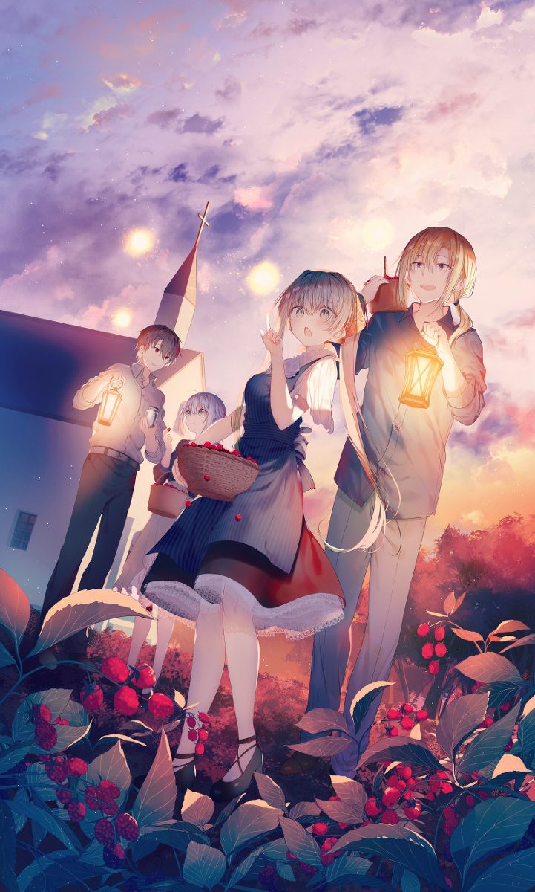

  

  <h1 align="center">Hi, I'm Lawrenclia. 👋</h1>

  

---

### About Me

- I am a student at **Shanghai Jiao Tong University**, majoring in Computer Science and Technology(IEEE pilot class).
- I'm currently exploring **PyTorch** to get started with machine learning and focusing on improving my **algorithm skills**.
- How to reach me: chianghx23@gmail.com

---

### Languages

  
  

#### Currently Learning

  
  

  
  
--- 
### My GitHub Stats

  

